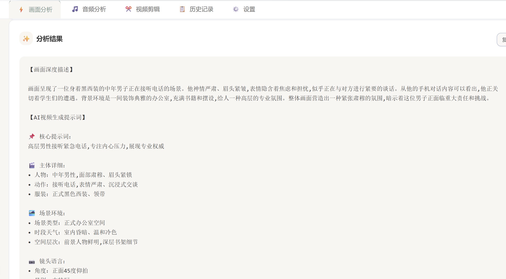
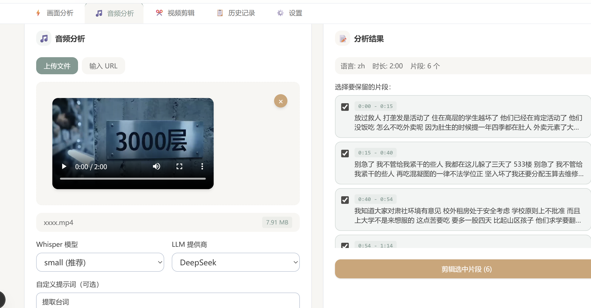
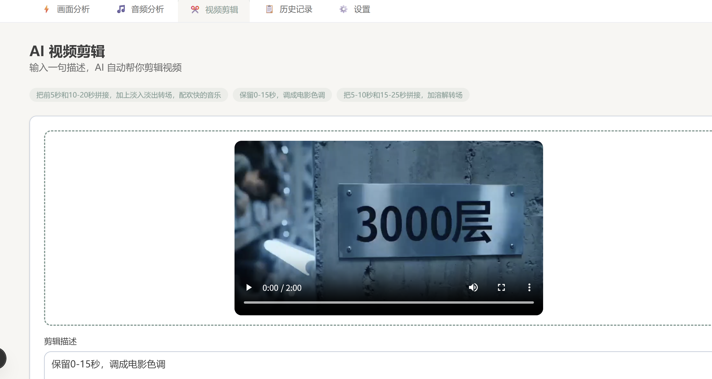

# PromptLens

AI 视频提示词分析工具 - 网页版

## 功能预览

### 画面分析


### 音频识别


### 视频剪辑


## 功能特性

- 📹 **视频分析**: 上传视频，AI 自动提取关键帧并分析
- 🖼️ **图片分析**: 支持单图或多图批量分析
- 🤖 **多 API 支持**: 智谱AI、Google Gemini、OpenRouter
- 📝 **历史记录**: 保存和分析您的提示词历史
- 🔐 **用户系统**: Google 登录，数据隔离
- 👨‍💼 **管理员后台**: 用户管理、操作日志审计
- 📊 **日志系统**: 完整操作记录追踪

## 技术栈

- **前端**: Next.js 15, React 19, TypeScript
- **UI**: Tailwind CSS, shadcn/ui
- **后端**: Next.js API Routes
- **数据库**: Supabase PostgreSQL, Drizzle ORM
- **认证**: better-auth
- **存储**: Backblaze B2
- **视频处理**: FFmpeg
- **测试**: Vitest, Playwright

## 快速开始

### 1. 安装依赖

```bash
pnpm install
```

### 2. 配置环境变量

复制 `.env.example` 到 `.env` 并填写配置：

```bash
cp .env.example .env
```

必需的环境变量：
- `DATABASE_URL` - PostgreSQL 数据库连接
- `BETTER_AUTH_SECRET` - better-auth 密钥
- `NEXT_PUBLIC_GOOGLE_CLIENT_ID` - Google OAuth Client ID
- `GOOGLE_CLIENT_SECRET` - Google OAuth Client Secret
- `R2_*` - Cloudflare R2 存储配置

### 3. 数据库设置

```bash
# 生成迁移文件
pnpm db:generate

# 执行迁移
pnpm db:migrate
```

### 4. 运行开发服务器

```bash
pnpm dev
```

访问 http://localhost:3000

## 使用说明

### 配置 API Key

1. 登录后进入「设置」页面
2. 选择 API 提供商（智谱AI/Gemini/OpenRouter）
3. 输入您的 API Key
4. 保存配置

### 分析视频/图片

1. 在首页点击上传或拖拽文件
2. 选择提取帧数（默认 8 帧）
3. 选择分析模式（逐帧/批量）
4. 点击「开始分析」
5. 等待 AI 分析完成
6. 复制生成的提示词

## 项目结构

```
prompt-analyzer/
├── app/                    # Next.js 应用
│   ├── api/               # API 路由
│   ├── dashboard/         # 主功能页面
│   └── login/             # 登录页面
├── components/            # React 组件
├── lib/                   # 核心库
│   ├── ai/                # AI 分析器
│   ├── auth/              # 认证配置
│   ├── cloudflare/        # R2 存储
│   ├── db/                # 数据库
│   └── middleware/        # 中间件
└── tests/                 # 测试文件
```

## API

### POST /api/upload
上传视频或图片

### POST /api/analyze
分析媒体并生成提示词

### GET /api/history
获取历史记录（需要登录）

## 部署

### Vercel 部署

```bash
# 构建
pnpm build

# 部署
vercel deploy
```

## License

MIT
